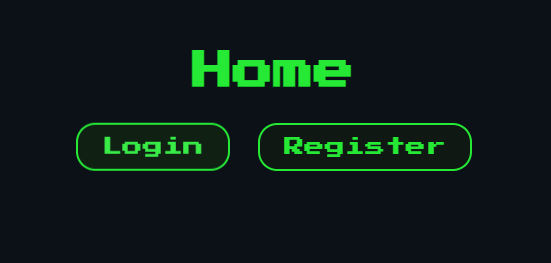
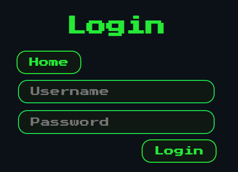
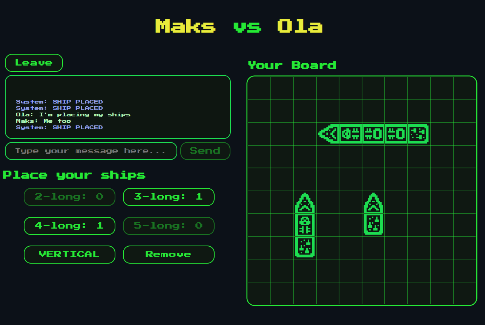

# Battleship — real-time multiplayer (Django + React + WebSockets)

Web application available at: https://bsplatform.duckdns.org/

> A small **Battleship** platform with login/registration, lobby, game invitations, 1:1 chat, and **real-time** gameplay. Backend built with Django (DRF + Channels + Redis), frontend with React.

---

# Table of contents

* [Preview / screenshots](#preview--screenshots)
* [Key features](#key-features)
* [Tech stack](#tech-stack)
* [Architecture](#architecture)
* [Game logic — summary](#game-logic--summary)
* [Quick start (local dev)](#quick-start-local-dev)
* [Deployment: AWS EC2 + Nginx + Daphne (ASGI) + Redis](#deployment-aws-ec2--nginx--daphne-asgi--redis)

---

# Preview / screenshots

* **Home** — login / registration navigation buttons

  

* **Login/Register** — login / registration views

  
  

* **Lobby** — list of online users, invitations, chats

  

* **Game** — ship placement, turns, hit/miss marks, in-game chat 

  
  

---

# Key features

* 🔐 **Login & registration** (Django + DRF), CSRF protection on frontend.
* 🛋️ **Lobby**:
  * real-time list of active users,
  * **game invitations** (send, cancel, 60s timeout, accept/decline),
  * **DM chats 1:1** with a blinking indicator on new messages, clears history after 30s of both users leaving the app.
* 🕹️ **Battleship game** (two players):
  * ship placement (rotate, remove),
  * mark readiness (both → game start),
  * randomize who goes first,
  * turn-based gameplay with instant synchronization (hit/miss/X/O, dimming of sunk ships),
  * turn/game over indicator, rematch voting,
  * in-game chat (room-only),
  * ability to leave to lobby at any time,
  * 10s timer on app leave before counting it as game disconnect (in case of refresh).
* 💬 **System messages** (local or shared) for key actions: placing/removing ships, hit/miss, sunk, readiness, game over, join/leave.
* 📱 **Responsive UI** — works on mobile browsers.a

---

# Tech Stack

**Backend**  
- Django 5.2  
- Django REST Framework (DRF)  
- Django Channels  
- Redis  
- SQLite  
- python-dotenv  
- corsheaders  

**Frontend** 
- React 19  
- React Router v7.5  
- Axios  
- WebSocket API  

---

# Architecture

The system uses a **client-server architecture** with real-time multiplayer features.

## Frontend
- Handles authentication, lobby state, chat, and game state.
- Communicates with backend via REST API (DRF) and WebSockets (Channels).
- Manages state with React hooks (`useState`, `useEffect`, `useRef`).

## Backend
- Serves REST APIs for login, registration, session management.
- Manages real-time communication (lobby, chat, game) via Django Channels + Redis.
- Stores persistent data in SQLite and ephemeral data in Redis.
- Handles game logic and cleanup tasks asynchronously.

## Communication Flow
1. **Authentication** – REST API session check; CSRF protection.
2. **Lobby** – WebSocket pushes user list, invites, chat messages; heartbeat pings refresh TTL.
3. **Game** – Real-time game actions sent via WebSocket; backend validates and broadcasts updates.
4. **State Tracking** – Redis manages online status, chat history, ephemeral game state; cleanup removes inactive sessions.

## Notes
- Async functions on backend handle multiple WebSocket connections concurrently.
- Lobby/game state and chat notifications are reactive, providing instant updates.


---

# Game logic — summary

## 1. Setup
   - Each player has a 10x10 empty board.
   - Fleet composition per player:
     - 1 ship of length 5
     - 1 ship of length 4
     - 2 ships of length 3
     - 1 ship of length 2
   - Ships can be placed horizontally or vertically.
   - Validation prevents:
     - out-of-bounds placement
     - overlapping ships
     - exceeding the allowed number of ships per length
   - Ships can be removed (restoring availability).
   - Players must place all ships before marking as **ready**.

## 2. Gameplay
   - First turn is assigned randomly when the game is created.
   - On their turn, a player fires at coordinates `(x, y)`.
   - Outcomes:
     - **Hit** → square marked `X`
     - **Miss** → square marked `O`
     - **Sunk** → all coordinates of a ship are hit
     - **Game Over** → all opponent ships are sunk
   - Invalid moves are rejected:
     - shooting outside board
     - firing at the same square twice
     - firing when not your turn
   - After each move, turn passes to the opponent.

## 3. Ending
   - Winner is declared once all opponent ships are sunk.
   - Players may request a rematch or the game can be deleted (`end_game`).

## 4. State retrieval
   - At any moment, players can query the game state:
     - own board, opponent board, hits, placed ships
     - readiness of both players
     - whose turn it is
     - winner (if game ended)

---

# Quick start (local dev)

## 1. Clone the repository:
   ```bash
   git clone https://github.com/CruM-M/django-react-webapp.git
   cd django-react-webapp
   ```

## 2. Environment configuration:
   
   Create environmental files in main folders:
   
   ### Backend (`.env`)
   ```ini
   SECRET_KEY=your_secret_key
   DEBUG=True
   ALLOWED_HOSTS=localhost,127.0.0.1
   CSRF_TRUSTED_ORIGINS=http://localhost:5173,http://127.0.0.1:5173
   CORS_ALLOWED_ORIGINS=http://localhost:5173,http://127.0.0.1:5173
   REDIS_URL=redis://127.0.0.1:6379
   ```
  
   ### Frontend (`.env`)
   ```ini
   VITE_API_URL=http://localhost:8000/api
   VITE_WS_API_URL=ws://localhost:8000/ws
   ```

## 2. Backend setup:
   ```bash
   cd backend
   python -m venv venv

   # Acrivate the virtual environment:
   source venv/bin/activate   # On Windows: venv\Scripts\activate
   
   pip install -r requirements.txt
   python manage.py migrate
   
   # Run development server:
   daphne -b localhost -p 8000 backend.asgi:application
   ```

## 4. Frontend setup:
   ```bash
   cd frontend
   npm install
   npm run dev
   ```
   
## 6. Visit the app:
   http://localhost:5173

# Deployment: AWS EC2 + Nginx + Daphne (ASGI) + Redis

## 1. Launch EC2 instance 
   - Ubuntu 22.04 LTS.  
   - Open ports in **Security Groups**:  
     - 22 (SSH),  
     - 80 (HTTP),  
     - 443 (HTTPS),  
     - 8000.  

## 2. Connect to the EC2 instance
   ```bash
   ssh -i your_key_pair_from_ec2.pem ubuntu@<Instance's Public IPv4 address>
   ```
   or directly through the AWS console.
   
## 3. Update system and install dependencies 
   ```bash
   sudo apt update && sudo apt upgrade -y
   sudo apt install -y python3 python3-pip python3-venv redis-server nginx
   
   sudo systemctl enable redis-server
   sudo systemctl start redis-server
   sudo systemctl status redis-server
   ```

## 4. Clone your project & set up virtualenv
   ```bash
   git clone https://github.com/CruM-M/django-react-webapp.git
   cd django-react-webapp/backend

   python3 -m venv ~/battleships_venv
   source ~/battleships_venv/bin/activate
   pip install --upgrade pip
   pip install -r requirements.txt
   ```

## 5. Run database migrations & collect static files
   ```bash
   python manage.py migrate
   python manage.py collectstatic
   ```

## 6. Update .env files both for backend and frontend! 

## 7. Build frontend for production
   **Install Node.js (so you can build the frontend)**
   ```bash
   curl -fsSL https://deb.nodesource.com/setup_20.x | sudo -E bash -
   sudo apt install -y nodejs
   ```

   **Build React**
   ```bash
   cd ../frontend
   npm install
   npm run build
   ```

   **Copy the build folder to a path served by Nginx**
   ```bash
   sudo mkdir -p /home/ubuntu/django-react-webapp/frontend_build
   sudo cp -r dist/* /home/ubuntu/django-react-webapp/frontend_build/
   sudo chown -R www-data:www-data /home/ubuntu/django-react-webapp/frontend_build
   sudo chmod -R 755 /home/ubuntu/django-react-webapp/frontend_build
   ```

## 8. Configure Daphne
   **Create systemd service for Daphne**
   ```bash
   sudo nano /etc/systemd/system/daphne.service
   ```

   ```ini
   [Unit]
   Description=Daphne Server for Battleships
   After=network.target
  
   [Service]
   User=ubuntu
   Group=www-data
   WorkingDirectory=/home/ubuntu/django-react-webapp/backend
   Environment="PATH=/home/ubuntu/battleships_venv/bin"
   ExecStart=/home/ubuntu/battleships_venv/bin/daphne -b 0.0.0.0 -p 8000 backend.asgi:application
  
   [Install]
   WantedBy=multi-user.target
   ```

   **Reload systemd and start Daphne**
   ```bash
   sudo systemctl daemon-reload
   sudo systemctl enable daphne
   sudo systemctl start daphne
   sudo systemctl status daphne
   ```

## 9. Configure Nginx
   ```bash
   sudo nano /etc/nginx/sites-available/battleships
   ```

   ```ini
   server {
       listen 80;
       server_name <Instance's Public IPv4 address>;
  
       return 301 https://$host$request_uri;
   }
  
   server {
       listen 443 ssl;
       server_name <Instance's Public IPv4 address>;
  
       ssl_certificate /etc/letsencrypt/live/bsplatform.duckdns.org/fullchain.pem;
       ssl_certificate_key /etc/letsencrypt/live/bsplatform.duckdns.org/privkey.pem;
       include /etc/letsencrypt/options-ssl-nginx.conf;
       ssl_dhparam /etc/letsencrypt/ssl-dhparams.pem;
  
       root /home/ubuntu/django-react-webapp/frontend_build;
       index index.html;
  
       location / {
           try_files $uri /index.html;
       }
  
       location /api/ {
           proxy_pass http://127.0.0.1:8000;
           proxy_set_header Host $host;
           proxy_set_header X-Real-IP $remote_addr;
           proxy_set_header X-Forwarded-For $proxy_add_x_forwarded_for;
           proxy_set_header X-Forwarded-Proto $scheme;
       }
  
       location /ws/ {
           proxy_pass http://127.0.0.1:8000/ws/;
           proxy_http_version 1.1;
           proxy_set_header Upgrade $http_upgrade;
           proxy_set_header Connection "upgrade";
           proxy_set_header Host $host;
           proxy_set_header X-Real-IP $remote_addr;
           proxy_set_header X-Forwarded-For $proxy_add_x_forwarded_for;
           proxy_set_header X-Forwarded-Proto $scheme;
       }
  
       location ~* \.(?:ico|css|js|gif|jpe?g|png|woff2?|eot|ttf|svg)$ {
           expires 6M;
           add_header Cache-Control "public";
       }
   }
   ```

   **Increase server name hash bucket size**
   ```bash
   sudo nano /etc/nginx/nginx.conf
   ```
   ```ini
   server_names_hash_bucket_size 128;
   ```

   **Enable site and restart Nginx**
   ```bash
   sudo ln -s /etc/nginx/sites-available/battleships /etc/nginx/sites-enabled/
   sudo nginx -t
   sudo systemctl restart nginx
   sudo systemctl enable nginx
   ```

## 10. Optional: HTTPS with Certbot
   **Get a public domain then acquire a certificate**
   ```bash
   sudo apt install certbot python3-certbot-nginx -y
   sudo certbot --nginx -d <yourdomain.com>
   ```

   Remember to update your .env files, then rebuild frontend, copy build folder and restard Daphne/Nginx whenever you change the address.
  
   Now you can use the domain instead of the public IPv4 address.
